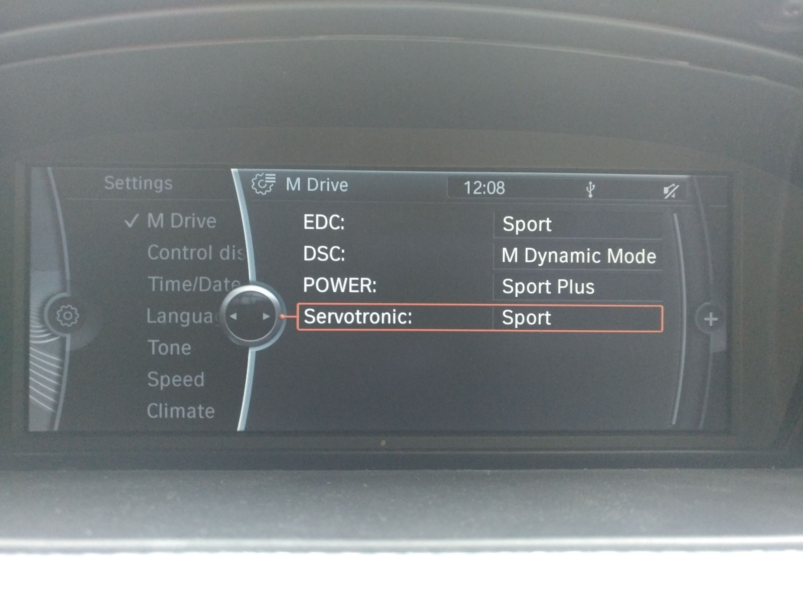
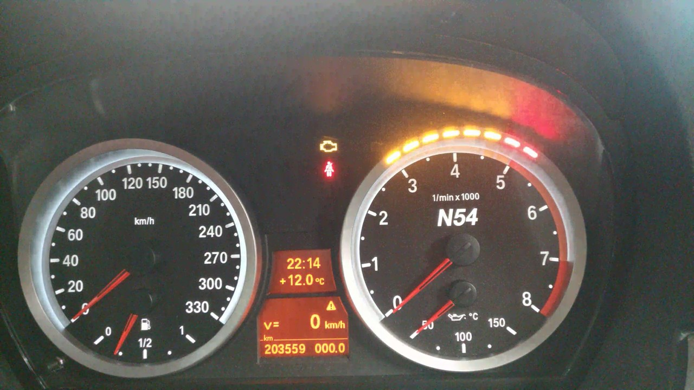
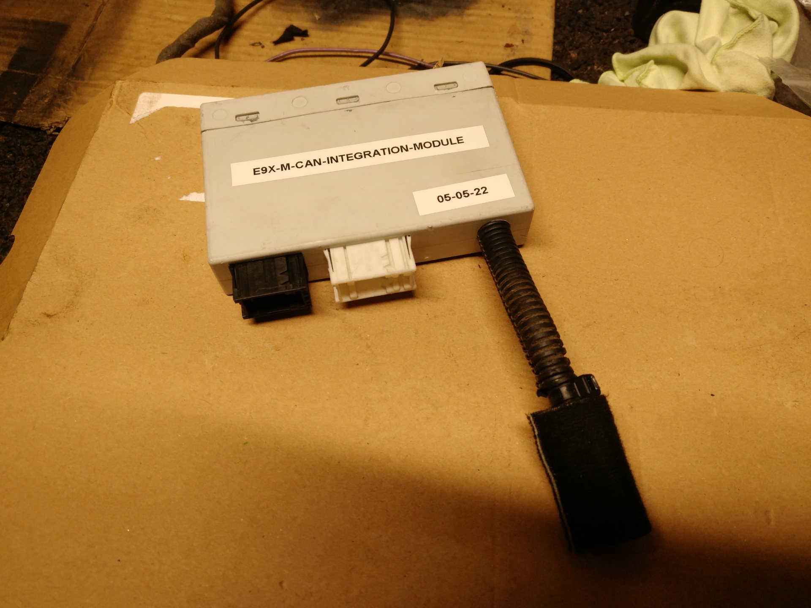
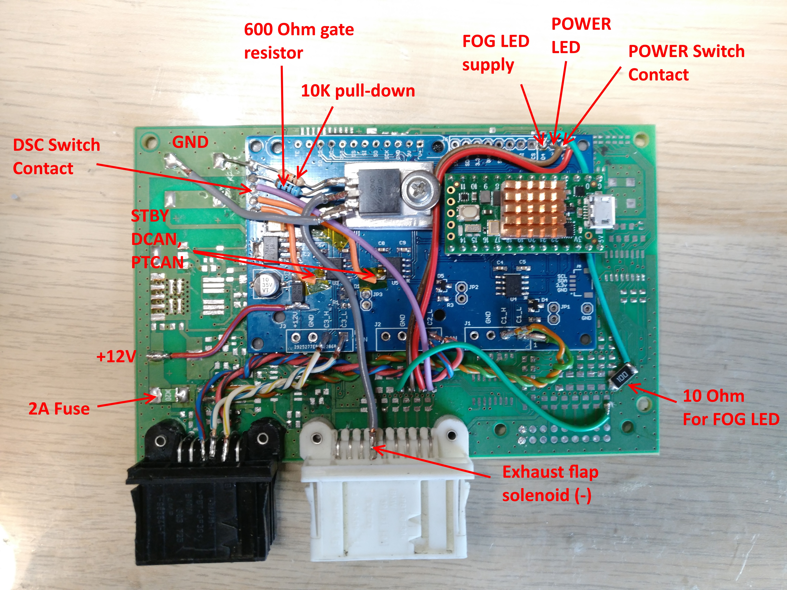

# E9X-M-CAN-Integration-Module
 
Unlike my previous modules, this one has access to PTCAN, KCAN and DCAN. While the code is quite specific for my particular car, much of the CAN message logic may be useful.
Included are also tools to allow full manipulation of the program section in the MSD81 bin file.

Hardware used:
 
* Skpang Triple CAN board https://copperhilltech.com/teensy-4-0-triple-can-bus-board-with-two-can-2-0b-and-one-can-fd-port/ (Teensy 4.0, MCP2562s).
* Small copper heatsink.
* N-channel MOSFET that can be driven with 3V3. I had some FQP50N06Ls.
* 1N4007 diode (exhaust solenoid flyback).
* 10K Ohm (pull-down), 600 Ohm (R-gate), 390 Ohm (POWER LED) and 10 Ohm (Fog LED) resistor.
* OSRAM LO M676-Q2S1 FOG button illumination LED.
* KINGBRIGHT KM2520ZGC-G03 FOG indicator LED.
* Micro USB right-angle cable.
* CR2450 620mAh battery. With a ~0.024 mA draw, the RTC should last around 3 years unpowered (terminal 30G OFF).
	-> https://www.nxp.com/docs/en/nxp/data-sheets/IMXRT1060CEC.pdf P.28 (SNVSS) + P.34 (RTC-OSC).
* Old PDC module PCB and housing. It has nice automotive connectors.

I use it to:

* Control MDrive settings from iDrive.
	* Control DME throttle map with the M button.
	* Control DTC/DSC OFF with the M button.
	* Control EDC mode with the M button.
	* Control Servotronic mode with the M button - through SVT70 module.
	* Control the exhaust flap position with the M button.
	* Display M Drive settings when holding M button
	* Control M Key settings from iDrive.
* Display Shiftlights - including startup animation, sync with the M3 KOMBI variable redline.
* Display a Needle sweep animation on startup.
* Display Launch Control flag.
* Control Centre console buttons and associated LED (POWER, DSC OFF).
* Fold/Un-fold mirrors when locking/unlocking.
* Immobilize the engine with a fuel pump cut-off until the M button is pressed X times.
	-> If engine is started without releasing this immobilizer, alarm will sound once engine stalls.
* Display Front fog lights ON (for M3 clusters that lack the symbol).
* Audibly warn when reverse gear is engaged.
* Create a HDC function similar to the one in xDrive cars.
* Display a CC when pressing the Auto Start-stop button instead of a blank button.
  OR
* Switch on the reversing camera when pressing the Auto Start-stop button.
* Enable FXX KCAN1 CIC controllers.
* Enable full diagnosis and coding of SVT70 modules.
* Turn on heated seats below a set temperature.
* Keep time and date in RTC and set back if KOMBI is reset (30G_F, battery removed/flat, coding, etc.).
	-> After uploading to Teensy, set the time manually/with ISTA to initialize the RTC to the same time.
* Close the exhaust flap before engine start to reduce start noise.
* Reduce audio volume when opening doors. Restore when closing.
* Dim corresponding front DRL when indicator is on.
* Turn on corresponding front fog light when steering angle threshold is exceeded.
See program notes: [here](program-notes.txt)

